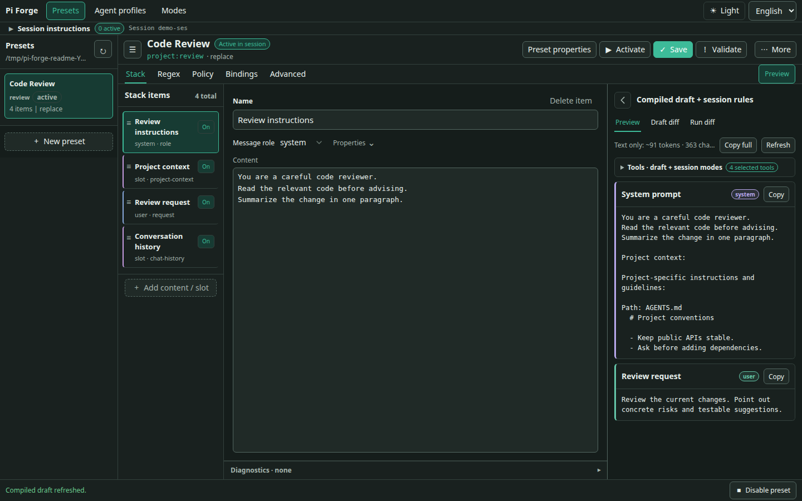
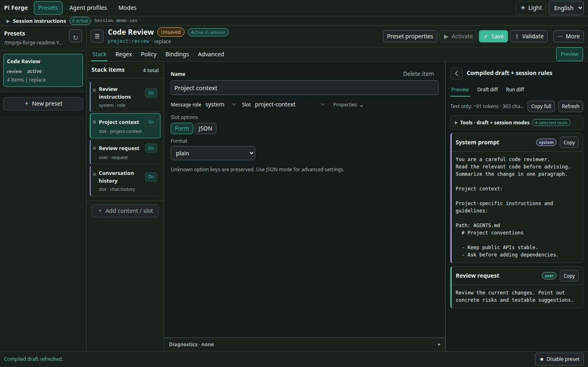
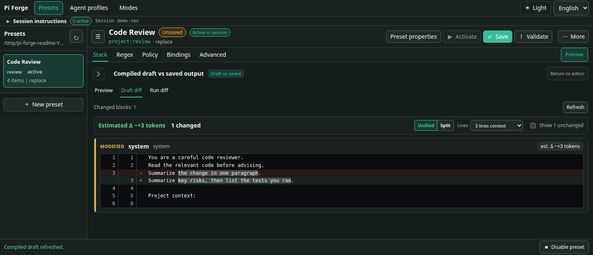

# pi-forge

[English](README.md) | [简体中文](README.zh-CN.md) · [Documentation](docs/README.md) · [Quick start](#install-and-first-run)

**Take full control of what your Pi agent sees and does.**

pi-forge is a visual workbench for [Pi](https://github.com/earendil-works/pi): edit prompts, arrange context, choose available tools, and save the setup for next time.

## Why I built it

Most AI agents let you add rules or edit a prompt, but don't make it easy to customize the full context. I want to change not just a few paragraphs, but how the system prompt, tool descriptions, project files, examples, and conversation history fit together.

I was used to SillyTavern's preset system, so this really annoyed me. I wanted to take the context apart, edit it, and inspect the requests actually sent to the model. So I built pi-forge.

<!-- MEDIA: editor-overview — PNG candidate. Real editor showing a useful preset, its blocks/slots, selected text, and compiled preview. No asset linked until reviewed. -->



## Features

### Compose the context

Build a Preset from text **blocks** and runtime **slots**. Write instructions or example messages; include tools, skills, project files, and chat history where you need them. Reorder or toggle items and check the result in Preview.

Replace Pi's base system prompt, append to it, or prepend to it. History options can filter roles, limit retained context, or strip prior thinking from model input without rewriting the stored conversation.

<!-- MEDIA: context-toggle — GIF candidate. One change only: toggle the project-context slot and show its corresponding paragraph disappear/reappear in Preview. Fixed view, no zoom or captions. -->



### Choose tools and transform text

- Set per-Preset tool `allow` or `deny` patterns instead of relying on an instruction to avoid a tool. These remain the ceiling for tools a Mode may enable.
- Choose a smaller default active tool set with `tools.initial`, then enable other permitted, registered tools through Modes when needed. Leave it unset to keep the existing selection behavior.
- Filter the skill listing rendered by Forge.
- Reuse immutable parameters through templates such as `{{ parameters.style }}`, alongside runtime values and custom macros.
- Apply deterministic Regex rules to outgoing text or completed assistant/tool-result text in the transcript.

### Change instructions during a session

Use **Instruction modes** to add or stop session rules and enable or disable tools without switching the whole Preset. For example, start with a small tool set and enable search tools when you need to explore the codebase. This changes the executable tool set, not just a sentence telling the model what to avoid.

Create reusable definitions in **Modes**, bind them to a Preset in **Bindings**, and activate them from **Session instructions** or `/system-update`. You can explicitly authorize individual bindings for Agent control with `modelCallable`; adding a mode to the library does not grant that permission.

Saving a Mode does not activate it, and editing its definition does not replace an already-active snapshot. Turning it off recomputes tools from the Preset's base selection and remaining Modes; it does not erase history, undo file changes, or interrupt running tools. See [Instruction modes](docs/reference/instruction-modes.md) for setup and lifecycle details.

### Inspect changes

- **Preview** compiles the current draft without making a model request.
- **Draft diff** compares unsaved edits with the saved Preset.
- **Run diff** compares successive provider turns, with size estimates kept separate from reported token/cache usage when available.
- **Payload capture** shows a redacted view of the next provider request through the editor or `/payload next`.

Cache notices also flag timestamp-sensitive macros and estimate the possible prompt-cache impact of Preset/Profile switches. Cache reuse belongs to the SDK/provider, so Mode or tool changes never guarantee a cache hit.

<!-- MEDIA: draft-diff — PNG candidate. A readable instruction change, shown as additions/removals against the saved preset. -->



### Reuse your setups

Save a model, thinking level, and Preset reference as an **Agent Profile**, then apply it with `/profile use <id>`. Keep Presets and Profiles in the project or your global library; a project resource takes precedence over a global resource with the same ID.

Use different setups for coding, reviewing, writing, or roleplay—not just different names for the same prompt.

## Install and first run

Requires Node.js **22.19 or newer**. The 0.5.5 line supports Pi **0.87.x** (`>=0.87.0 <0.88.0`), tested with **0.87.0**.

<!-- RELEASE NOTE: remove this block when 0.5.5 is published; keep the install command below. -->
> **0.5.5 is not published yet.** Instruction modes and configurable default tools currently require the local development build. The npm install command below still installs 0.5.4, whose features and Pi requirements differ. For a local build, see [development setup](docs/development/setup.md#load-the-extension).
<!-- END RELEASE NOTE -->

```bash
pi install npm:@zihanw/pi-forge
```

Restart Pi after installing or updating. In a trusted project:

1. Run `/preset ui` to open the local editor.
2. Choose **New preset** to start from the default Pi-mirror layout.
3. Edit a block or policy and check **Preview**.
4. **Save** your changes, then **Activate** the Preset for the current session.

Saving an inactive Preset does not select it. Saving the active Preset reloads its changes; active Mode snapshots remain unchanged.

You can also select one with `/preset use <id>`, or disable the current Preset with `/preset use none`. To reuse your current model, thinking level, and Preset together:

```text
/profile save reviewer
/profile use reviewer
```

## Presets, modes and profiles

| Resource | What it holds |
|---|---|
| **Preset** | Context layout, tool defaults and policy, Mode bindings and Agent authorization, skill-list filtering, Regex rules, and parameters |
| **Instruction mode** | Reusable session instructions and/or tool additions/removals; activated as a snapshot in a Session |
| **Agent Profile** | Model, thinking level, and a reference to a Preset |

The **Stack** is the ordered Block/Slot composition inside a Preset. Ordering works within two channels: system items form the system prompt; non-system items form messages. Moving a system block below chat history does not inject it into that history.

A Profile applies once. Later manual model or thinking-level changes remain in effect; the selected Preset continues enforcing its tool policy.

## Examples

- [Default Pi mirror](examples/default-prompt-stack.json) — A Pi-style starting point, split into editable blocks and runtime slots.
- [Minimal worker](examples/minimal-prompt-stack.json) — One line of instructions, chat history, and only `bash` plus `edit`.
- [Regex examples](examples/hack-prompt-stack.json) — Outgoing redaction paired with stored-transcript cleanup for two sample token patterns.

See [patterns and use cases](docs/guides/use-cases.md) for more ways to build on them.

## Optional subagents

The experimental `@zihanw/pi-forge-subagents` package lets an agent discover authorized Profiles with `forge_subagent_profiles` and delegate one-shot foreground tasks with `forge_subagent`.

Profiles must be explicitly enabled. Runs require approval by default; unattended model invocation requires explicit trusted-project authorization. Isolation depends on the selected backend—tool restrictions alone are not an OS sandbox.

Read the [delegation guide](docs/guides/delegation.md) before enabling it.

## Notes and documentation

- This is a **0.x** project; releases may introduce breaking changes.
- `replace` mode replaces Pi's base system prompt. Include any tool guidance, skills, or project context you still want.
- Skill filtering only changes Forge's rendered listing; it does not disable explicit skill invocation. Tool policy is not filesystem or process isolation.
- Regex only handles the text and patterns you select. `finalize` overwrites stored assistant/tool-result text and does not preserve the original. Payload captures are redacted and may be truncated; they can still contain private conversation content.

[Getting started](docs/getting-started.md) · [Web editor](docs/guides/web-editor.md) · [Commands](docs/reference/commands.md) · [Schema and policy](docs/reference/stack-schema.md) · [Debugging](docs/guides/debugging.md) · [All documentation](docs/README.md)

## License

[MIT](LICENSE)
