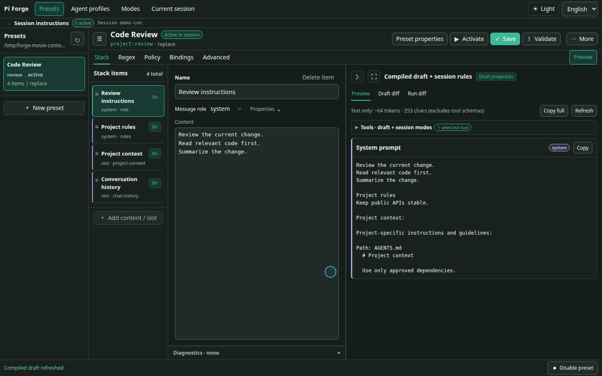

# pi-forge

[English](README.md) | [简体中文](README.zh-CN.md) · [Documentation](docs/README.md) · [Quick start](#install-and-first-run)

**A context editor and inspection workbench for Pi.**

pi-forge provides visual context composition, tool selection, reusable configurations, and request inspection for [Pi](https://github.com/earendil-works/pi).

## Why I built it

I wanted to configure both the content and composition of an agent’s input: system instructions, tool descriptions, project files, examples, and conversation history.

Inspired by my experience with SillyTavern's presets, I built pi-forge to edit these components in Pi and inspect the requests sent to the model.



## Features

### Context composition

A Preset combines text **blocks** with runtime **slots** for tools, skills, project files, and conversation history. Blocks can contain instructions or example messages. Items support ordering and individual enablement; Preview shows the compiled result.

Replace Pi's base system prompt, append to it, or prepend to it. History options can filter roles, limit retained context, or strip prior thinking from model input without rewriting the stored conversation.


### Tool selection and text transforms

- Set per-Preset tool `allow` or `deny` patterns instead of relying on an instruction to avoid a tool. These remain the permission ceiling for tools a Mode may enable.
- Choose a smaller default active tool set with `tools.initial`, then enable other permitted, registered tools through Modes when needed. Leave it unset to keep the existing selection behavior.
- Filter the skill listing rendered by Forge.
- Reuse immutable parameters through templates such as `{{ parameters.style }}`, alongside runtime values and custom macros.
- Apply deterministic Regex rules to outgoing text or completed assistant/tool-result text in the transcript.

### Session instruction modes

**Instruction modes** add or stop session rules and adjust executable tools without switching Presets. A typical use is enabling permitted search tools during code exploration while retaining a smaller default tool set.

Create reusable definitions in **Modes** and configure Preset authorization in its peer **Bindings** tab. In **Current session**, the picker separates unbound library modes from current-Preset bindings; CLI `/instruction use` and `use-bound` make the same distinction. `/system-update` remains an exact compatibility alias. You can explicitly authorize individual bindings for Agent control with `modelCallable`; adding a mode to the library does not grant that permission.

Saving a Mode does not activate it, and editing its definition does not replace an already-active snapshot. Turning it off recomputes tools from the Preset's base selection and remaining Modes; it does not erase history, undo file changes, or interrupt running tools. See [Instruction modes](docs/reference/instruction-modes.md) for setup and lifecycle details.

**Current session** places mode/tool controls beside the session projection. Inspect net tool changes and locate related instruction updates without closing the controls. This view uses the active saved Preset, not the editor draft or a captured provider request.


### Preview and request inspection

- **Preview** compiles the current draft without making a model request.
- **Draft diff** compares unsaved edits with the saved Preset.
- **Run diff** compares successive provider turns, with size estimates kept separate from reported token/cache usage when available.
- **Payload capture** shows a redacted view of the next provider request through the editor or `/forge payload next`.

Cache notices also flag timestamp-sensitive macros and estimate the possible prompt-cache impact of Preset/Profile switches. Cache reuse belongs to the SDK/provider, so Mode or tool changes never guarantee a cache hit.


### Recommended CLI names

Use `/forge ui` for the workspace, `/forge payload` for request-hook capture, and `/instruction` for session instruction modes. `/preset` and `/profile` keep their existing roots. Compatibility entries remain available: `/preset ui` maps to `/forge ui`, `/payload` and `/intercept` arm the next payload capture, and `/system-update` maps to `/instruction`.

`/forge` with no arguments shows help. Command arguments are strict; unknown flags are rejected. `/forge payload next save="path with spaces.json"` accepts an optional save path; existing files require `--overwrite` (which is valid only with `save=<path>`). `cancel` only cancels a pending capture and does not erase capture/history data. Capture occurs at the provider hook, so later plugin shaping may differ from the final wire body.

## Reusable configurations

An **Agent Profile** stores a model, thinking level, and Preset reference. Apply it with `/profile use <id>`. Presets and Profiles have project or global scope; project resources take precedence for matching IDs.

Maintain separate configurations for coding, reviewing, writing, or roleplay.

## Install and first run

Requires Node.js **22.19 or newer**. The 0.5.5 line supports Pi **0.87.x** (`>=0.87.0 <0.88.0`), tested with **0.87.0**.

<!-- RELEASE NOTE: remove this block when 0.5.5 is published; keep the install command below. -->
> **0.5.5 is not published yet.** Instruction modes and configurable default tools currently require the local development build. The npm install command below still installs 0.5.4, whose features and Pi requirements differ. For a local build, see [development setup](docs/development/setup.md#load-the-extension).
<!-- END RELEASE NOTE -->

```bash
pi install npm:@zihanw/pi-forge
```

Restart Pi after installing or updating. In a trusted project:

1. Run `/preset ui` to open the local editor.
2. Choose **New preset** to start from the default Pi-mirror layout.
3. Edit a block or policy and check **Preview**.
4. **Save** your changes, then **Activate** the Preset for the current session.

Saving an inactive Preset does not select it. Saving the active Preset reloads its changes; active Mode snapshots remain unchanged.

You can also select one with `/preset use <id>`, or disable the current Preset with `/preset use none`. To reuse your current model, thinking level, and Preset together:

```text
/profile save reviewer
/profile use reviewer
```

## Presets, modes and profiles

| Resource | What it holds |
|---|---|
| **Preset** | Context layout, tool defaults and policy, Mode bindings and Agent authorization, skill-list filtering, Regex rules, and parameters |
| **Instruction mode** | Reusable session instructions and/or tool additions/removals; activated as a snapshot in a Session |
| **Agent Profile** | Model, thinking level, and a reference to a Preset |

The **Stack** is the ordered Block/Slot composition inside a Preset. Ordering works within two channels: system items form the system prompt; non-system items form messages. Moving a system block below chat history does not inject it into that history.

A Profile applies once. Later manual model or thinking-level changes remain in effect; the selected Preset continues enforcing its tool policy.

## Examples

- [Default Pi mirror](examples/default-prompt-stack.json) — A Pi-style starting point, split into editable blocks and runtime slots.
- [Minimal worker](examples/minimal-prompt-stack.json) — One line of instructions, chat history, and only `bash` plus `edit`.
- [Read-first Worker](examples/read-first-worker-prompt-stack.json) + [Write tools mode](examples/instruction-modes/write-tools.json) — start with `read`, `ls`, and the mode control tool; let the model enable `bash`/`edit` on demand. [Setup and limits](docs/reference/instruction-modes.md#read-first-worker).
- [Regex examples](examples/hack-prompt-stack.json) — Outgoing redaction paired with stored-transcript cleanup for two sample token patterns.

See [patterns and use cases](docs/guides/use-cases.md) for more ways to build on them.

## Optional subagents

The matching development `@zihanw/pi-forge-subagents` package contributes the `/forge subagent plan` execution-plan command and lets an agent discover authorized Profiles with `forge_subagent_profiles` and delegate one-shot tasks with `forge_subagent`. The legacy `/subagent` command remains a separate low-level smoke helper.

Profiles must be explicitly enabled. `/forge-agent run` always asks for human approval and the selected backend may write; the model-callable `forge_subagent` path is separate and can be unattended only with explicit trusted-project authorization. Isolation depends on the selected backend—tool restrictions alone are not an OS sandbox. Use matching local development sources until the coordinated release; this does not claim a published package pairing.

Read the [delegation guide](docs/guides/delegation.md) before enabling it.

## Notes and documentation

- This is a **0.x** project; releases may introduce breaking changes.
- `replace` mode replaces Pi's base system prompt. Include any tool guidance, skills, or project context you still want.
- Skill filtering only changes Forge's rendered listing; it does not disable explicit skill invocation. Tool policy is not filesystem or process isolation.
- Regex only handles the text and patterns you select. `finalize` overwrites stored assistant/tool-result text and does not preserve the original. Payload captures are redacted and may be truncated; they can still contain private conversation content.

[Getting started](docs/getting-started.md) · [Web editor](docs/guides/web-editor.md) · [Commands](docs/reference/commands.md) · [Schema and policy](docs/reference/stack-schema.md) · [Debugging](docs/guides/debugging.md) · [All documentation](docs/README.md)

## License

[MIT](LICENSE)
