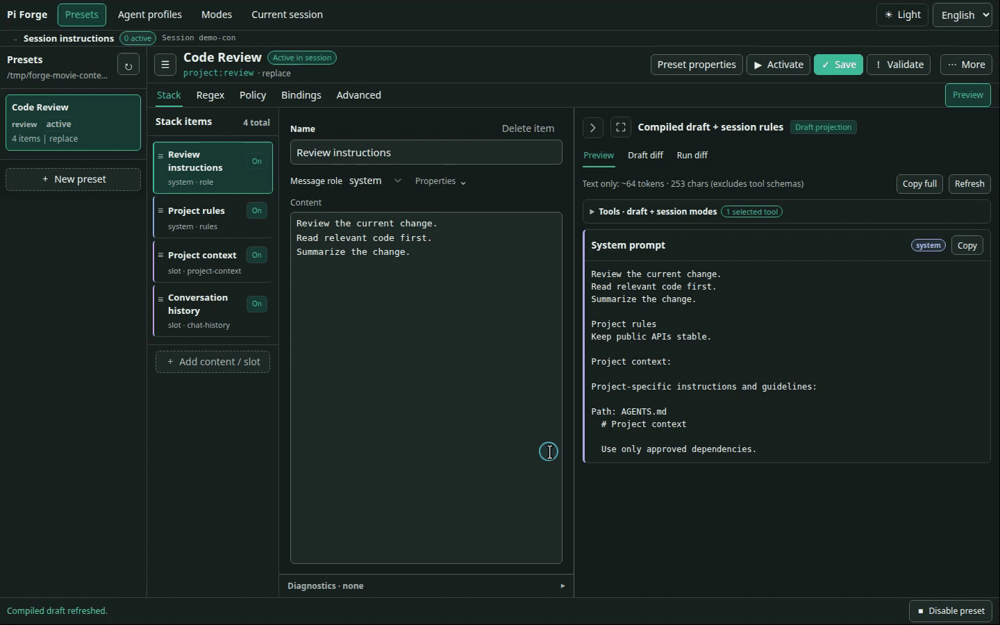
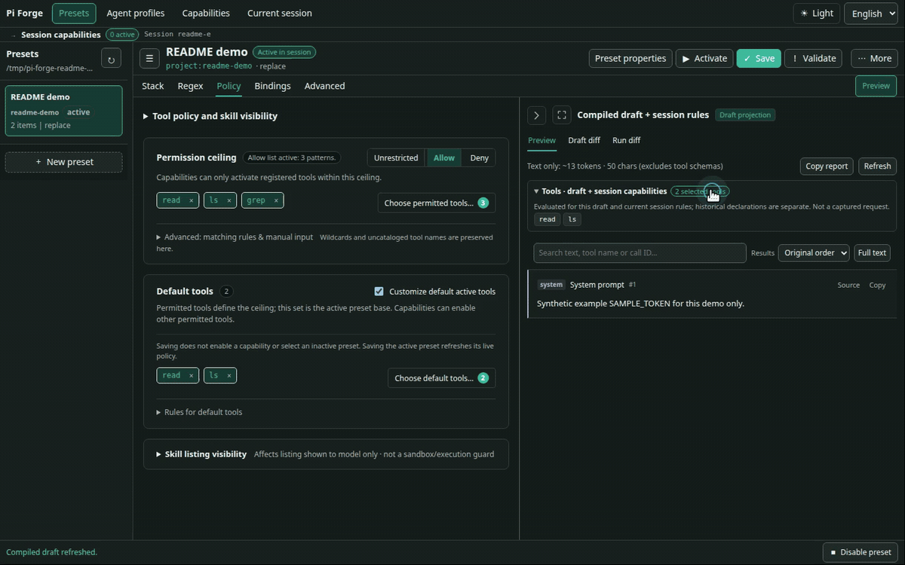
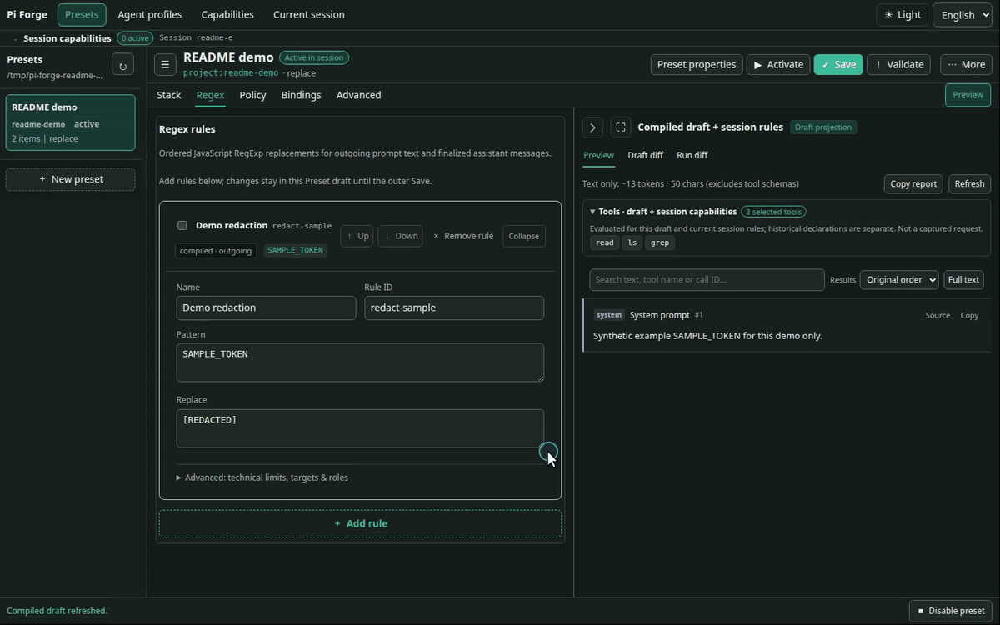
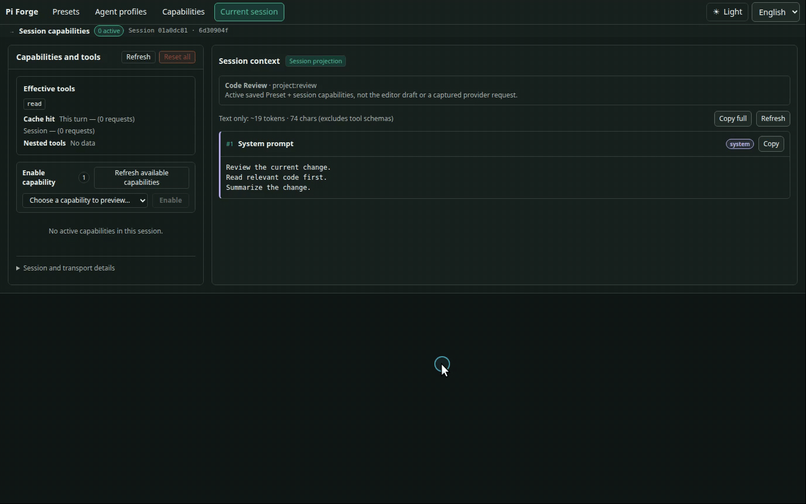
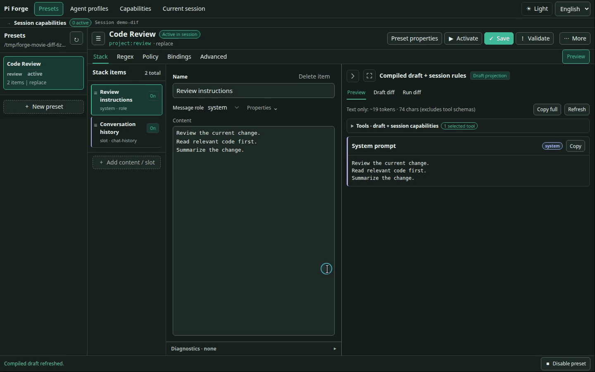

# pi-forge

[English](README.md) | [简体中文](README.zh-CN.md) · [Documentation](docs/README.md) · [Quick start](#install-and-first-run)


**A context editor and inspection workbench for Pi.**

pi-forge provides visual context composition, tool selection, reusable configurations, and request inspection for [Pi](https://github.com/earendil-works/pi).

> Inspired by SillyTavern’s presets, I built pi-forge to customize both what goes into an agent’s context and how it is assembled—and inspect what actually reaches the model.

[Context composition](#context-composition) · [Tool selection](#tool-selection) · [Regex transformations](#regex-transformations) · [Capabilities](#dynamic-system-prompts-and-tools) · [Request inspection](#preview-and-request-inspection)

> **Optional subagents**: [pi-forge-subagents](https://github.com/MacroSony/pi-forge-subagents) — Delegate tasks to agents with their own model and preset.

## Install and first run

Requires Node.js **22.19 or newer**. The 0.5.6 line supports Pi **0.87.x** (`>=0.87.0 <0.88.0`), tested with **0.87.0**.

> **Version note:** This README describes Forge **0.5.6**. Capabilities and configurable default tools require 0.5.5; optional subagents have a separate [compatibility requirement](docs/reference/subagent-host-port.md#tool-selection-compatibility).

```bash
pi install npm:@zihanw/pi-forge
```

Restart Pi after installing or updating. In a trusted project:

1. Run `/forge ui` to open the local editor.
2. Choose **New preset** to start from the default Pi-mirror layout.
3. Edit a block or policy and check **Preview**.
4. **Save** your changes, then **Activate** the Preset for the current session.

Prefer the terminal? Select a Preset with `/preset use <id>` and enable a Capability with `/capability enable <capability>`. Try the [Read-first Worker example](docs/reference/capabilities.md#read-first-worker) yourself.

## Features

### Context composition

Build your agent’s context from editable text blocks and slots for tools, skills, project files, and conversation history. Reorder or toggle them and see the result in Preview.

- **Use case**: Give a code-review agent your project guidelines and selected context, instead of keeping one oversized prompt for every task.
- **Try it**: In the editor’s **Stack**, edit or drag a block, toggle project context, and check **Preview**.



See [Web editor guide](docs/guides/web-editor.md) and [Stack schema](docs/reference/stack-schema.md).

### Tool selection

Choose which tools an agent may use and which are available by default. An allowlist or denylist sets the permission limit; a smaller default set keeps other permitted tools available for Capabilities to enable later.

- **Use case**: Keep a review agent focused on reading and searching, without giving it editing or shell tools.
- **Try it**: In **Policy**, choose the permitted tools and a default set such as `read` and `ls`. Add the already-permitted `grep` to the defaults and check the tool list in **Preview**; save and activate to apply the policy.



See [Tool policy reference](docs/reference/stack-schema.md#tool-and-skill-policy).

### Regex transformations

Find and replace text in model input or completed assistant/tool output using reusable regex rules.

- **Use case**: Replace a known sensitive marker in selected prompt text before sending it, or clean repetitive boilerplate from responses.
- **Try it**: In **Regex**, set up an outgoing rule matching the synthetic `SAMPLE_TOKEN`, replacing it with `[REDACTED]`, and targeting system text. The demo toggles this preconfigured rule and compares **Preview**.



See [Regex transformation reference](docs/reference/stack-schema.md#regex-transforms).

### Dynamic system prompts and tools

**Capabilities** update system instructions and available tools mid-conversation. Start an agent with minimal tools, then let it load task-specific instructions and tools when needed—without restarting the session or switching Presets.

- **Use case**: Let an agent explore code with `read` and `ls`, then enable an authorized editing Capability when it is ready to apply a fix.
- **Try it**: Create a Capability in **Capabilities** and authorize agent access in the Preset’s **Bindings** tab. You can also enable it yourself in **Current session** or with `/capability enable <capability>`, and inspect the resulting instructions and tools.

Updates reach the model as native mid-conversation system updates on supported models, with a labeled user-message fallback otherwise (see [delivery details](docs/reference/capabilities.md#delivery-models-native-vs-fallback)).

On supported provider/model combinations, adding or removing tools can preserve the cached prompt prefix. Support differs for additions and removals, and cache hits are not guaranteed; see [provider support and cache observations](docs/reference/provider-support.md#observed-cache-behavior).



See [Capabilities reference](docs/reference/capabilities.md).

### Preview and request inspection

See what your edits change before calling a model, then inspect captured requests and reported usage when debugging a run.

- **Use case**: Check whether a prompt edit adds the intended instructions, or compare successive requests when a run behaves differently than expected.
- **Try it**: In `/forge ui`, switch to **Preview** to view compiled messages, open **Draft diff** to see unsaved changes, or run `/forge payload next` in the terminal to inspect the next outgoing request.



**Current session** also shows turn and branch cache-hit rates, with main-model and reported nested-tool usage kept separate. These are recorded usage metrics, not a complete bill. See [cache usage](docs/reference/session-cache.md), [debugging](docs/guides/debugging.md), and [commands](docs/reference/commands.md).

## Examples

- [Default Pi mirror](examples/default-prompt-stack.json) — A Pi-style starting point, split into editable blocks and runtime slots.
- [Minimal worker](examples/minimal-prompt-stack.json) — One line of instructions, chat history, and only `bash` plus `edit`.
- [Read-first Worker](examples/read-first-worker-prompt-stack.json) + [Write tools capability](examples/capabilities/write-tools.json) — Start with `read`, `ls`, and the capability control tool; let the model enable `bash`/`edit` on demand. [Setup and limits](docs/reference/capabilities.md#read-first-worker).
- [Regex examples](examples/hack-prompt-stack.json) — Outgoing redaction paired with stored-transcript cleanup for two sample token patterns.

Save your current model, thinking level, and Preset as an Agent Profile with `/profile save reviewer`; restore it with `/profile use reviewer`. See [patterns and use cases](docs/guides/use-cases.md) for more ideas.

## Optional subagents

The optional companion [`pi-forge-subagents`](https://github.com/MacroSony/pi-forge-subagents) package lets your agent delegate focused tasks—such as a code review or parallel investigation—to subagents configured with authorized Profiles. The agent uses `forge_subagent` to delegate; Forge itself does not require this package.

Use matching local development sources pending coordinated release. Subagents operate with backend-dependent write permissions and isolation (tool restrictions alone are not an OS sandbox). See the [delegation guide](docs/guides/delegation.md) before enabling delegation.

## Notes and documentation

- This is a **0.x** project; releases may introduce breaking changes.
- `replace` mode replaces Pi's base system prompt. Include any tool guidance, skills, or project context you still want.
- Skill filtering only changes Forge's rendered listing; it does not disable explicit skill invocation. Tool policy is not filesystem or process isolation.
- Regex only handles the text and patterns you select. `finalize` overwrites stored assistant/tool-result text and does not preserve the original. Payload captures are redacted and may be truncated; they can still contain private conversation content.
- For stack structure, resource schemas, and command details, see the documentation links below.

[Getting started](docs/getting-started.md) · [Web editor](docs/guides/web-editor.md) · [Commands](docs/reference/commands.md) · [Schema and policy](docs/reference/stack-schema.md) · [Debugging](docs/guides/debugging.md) · [All documentation](docs/README.md)

## License

[MIT](LICENSE)
