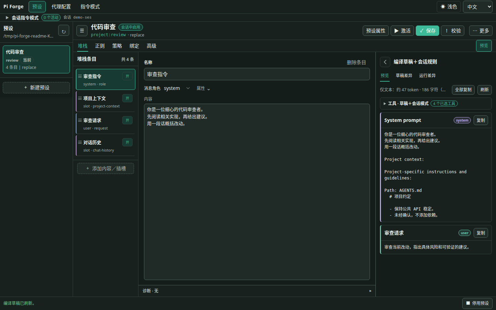
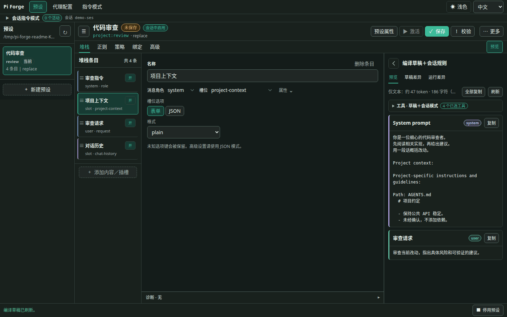
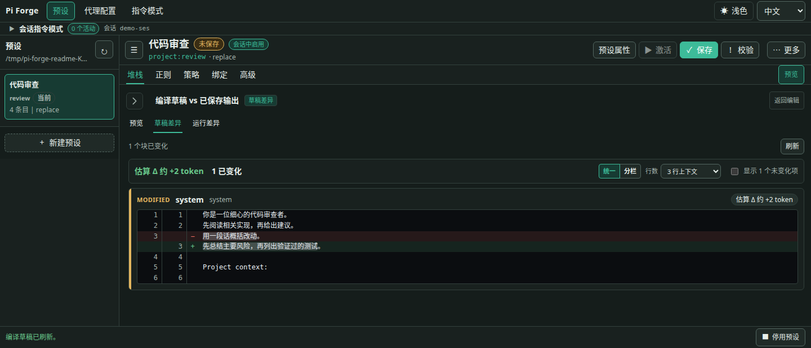

# pi-forge

[English](README.md) | [简体中文](README.zh-CN.md) · [中文文档](docs/zh-CN/README.md) · [快速开始](#安装与第一次使用)

**全面掌控你的 Pi Agent 看到什么、能做什么。**

pi-forge 给 [Pi](https://github.com/earendil-works/pi) 加了一个可视化工作台。你可以在里面改提示词、调整上下文、选工具，再把调好的配置存下来，下次接着用。

## 为什么做这个插件

现在大部分 AI Agent 都能加规则、改提示词，但想方便地自定义整套上下文，就没那么容易了。我想改的不只是几段文字，还有系统提示词、工具说明、项目文件、示例消息和聊天记录怎么拼在一起。

我用惯了 SillyTavern 的预设系统，对这点很不爽。我想把上下文拆开细改，也想检查真正发给模型的请求。所以就做了 pi-forge。

<!-- MEDIA: editor-overview — PNG 候选。真实编辑器中展示一个有实际用途的预设、内容块／插槽、选中的文本与编译预览；审核素材前不插图片链接。 -->



## 功能

### 编排上下文

一份预设由写好的**内容块（Block）**和运行时填入的**插槽（Slot）**组成。写入指令或示例消息，把工具说明、技能、项目文件和聊天记录放到需要的位置。条目可以排序、开关，改完在 Preview 里看结果。

你可以替换 Pi 默认的系统提示词，也可以只在它前面或后面加内容。聊天记录能按角色筛选、限制保留的上下文，或者从模型输入中去掉先前的思考内容，不会改写已存储的聊天记录。

<!-- MEDIA: context-toggle — GIF 候选。只展示一件事：切换 project-context 插槽，右侧预览中对应的段落消失／恢复。固定画面，不缩放，不加字幕。 -->



### 选择工具与处理文本

- 每份预设都能用 `allow` 或 `deny` 匹配规则控制工具，不必只写一句话让模型避开某个工具。模式按需启用工具，也不能越过这个许可范围。
- 用 `tools.initial` 选一小组默认启用的工具，需要时再通过模式开启其他已注册、已获准的工具。不配置这个字段，就沿用原有的工具选择行为。
- 筛选 Forge 展示给模型的技能列表。
- 重复用到的值可以存成不可变参数，再用 `{{ parameters.style }}` 这样的模板插进内容；也可以使用运行时数据和自定义宏。
- 用正则按确定的规则改写出站文本，或者会话记录里已完成的助手消息和工具结果。

### 在会话中调整规则和工具

用**指令模式（Instruction mode）**追加或停用会话规则、开关工具，不必换掉整份预设。比如平时只带少量工具，需要查代码时再开启搜索工具。这里改变的是真正可执行的工具集，不只是告诉模型“不要用某个工具”。

在 **指令模式（Modes）** 中创建可复用的定义，在预设的 **绑定（Bindings）** 中绑定，再从 **会话指令模式（Session instructions）** 或 `/system-update` 启用。想让 Agent 自己控制，可以为具体绑定打开 `modelCallable` 授权；光把模式放进库里，不会自动授予权限。

保存模式不等于启用，修改定义也不会替换会话中已经启用的快照。停用时，会按预设的基础工具集和其他仍启用的模式重新计算；不会抹掉历史、撤回已做的文件修改或中断正在运行的工具。设置方法和生命周期见[指令模式参考](docs/zh-CN/reference/instruction-modes.md)。

### 看清每次改动

- **预览（Preview）**：编译当前草稿，不需要真的请求模型。
- **草稿差异（Draft diff）**：和已保存的预设比较，看看还没保存的修改有哪些。
- **运行差异（Run diff）**：比对前后两次 provider 请求。大小估算与 provider 返回的 token／cache 用量分开展示，后者在有返回数据时才显示。
- **请求捕获（Payload capture）**：通过编辑器或 `/payload next`，查看下一次 provider 请求的脱敏版本。

缓存提示会标出容易影响缓存的时间戳宏，也会估算切换预设或 Profile 可能带来的提示词缓存影响。缓存是否复用由 SDK／provider 管理，启停模式或增减工具都不保证命中缓存。

<!-- MEDIA: draft-diff — PNG 候选。展示一处容易读懂的指令修改，以及相对已保存预设的增删高亮。 -->



### 复用你的配置

把模型、思考强度，以及要用哪份预设存成 **Agent Profile**，以后用 `/profile use <id>` 一次应用。预设和 Profile 都可以放在项目里，也可以存到用户全局目录；项目里有同 ID 的配置时，优先用项目里的那份。

编程、审查、写作、角色扮演，都可以分别配一套，不只是给同一段提示词换个名字。

## 安装与第一次使用

Node.js 需要 **22.19 或更高版本**。0.5.5 支持 Pi **0.87.x**（`>=0.87.0 <0.88.0`），已在 **0.87.0** 上验证。

<!-- 发布提示：0.5.5 发布后移除本段；保留下方安装命令。 -->
> **0.5.5 尚未发布。** 指令模式和可配置默认工具目前需要本地开发版。下方 npm 安装命令装到的仍是 0.5.4，它的功能和 Pi 版本要求与这里不同。
> 本地构建与加载方式见[开发配置（英文）](docs/development/setup.md#load-the-extension)。
<!-- END RELEASE NOTE -->

```bash
pi install npm:@zihanw/pi-forge
```

安装或更新后重启 Pi。然后在已信任的项目中：

1. 输入 `/preset ui`，打开本地编辑器。
2. 点 **New preset**，从默认 Pi mirror 布局开始。
3. 改一个内容块或工具策略，在 **Preview** 里看结果。
4. 点 **Save** 保存，再点 **Activate**，让当前会话用上这份预设。

保存和切换是两回事：改的是未启用的预设，保存后不会自动切过去；改的是正在用的预设，保存后会重新加载，但已经启用的模式快照不会被替换。

终端里也可以用 `/preset use <id>` 切换，用 `/preset use none` 停用当前预设。如果想把当前模型、思考强度和预设一起存下来：

```text
/profile save reviewer
/profile use reviewer
```

## Preset、Mode 和 Profile

| 名称 | 保存什么 |
|---|---|
| **Preset（预设）** | 上下文编排、默认工具与工具策略、模式绑定和 Agent 授权、技能列表过滤、正则规则和参数 |
| **Instruction mode（指令模式）** | 可复用的会话规则、工具增减，或两者组合；启用后作为快照保留在会话中 |
| **Agent Profile** | 模型、思考强度，以及要用哪份预设 |

**Stack（提示词栈）** 就是预设里按顺序排列的内容块和插槽。排序分两个通道：system 条目拼成系统提示词，非 system 条目组成消息。把一个 system 内容块拖到聊天记录后面，并不会把它插进那段历史。

Profile 只在应用时切一次设置。之后你手动换模型或思考强度，它不会再给你改回去；正在用的预设仍然会管住工具范围。

## 示例

- [默认 Pi mirror](examples/default-prompt-stack.json)：从一份 Pi 风格的配置开始，内容已经拆成可编辑的文本块和运行时插槽。
- [Minimal worker](examples/minimal-prompt-stack.json)：一行提示词、聊天记录，只留 `bash` 和 `edit` 两个工具。
- [正则示例](examples/hack-prompt-stack.json)：拿两种示例 token 格式，演示发送前脱敏，以及清理已存储的会话文本。

更多用法见[模式与用例（英文）](docs/guides/use-cases.md)。

## 可选 Subagents

装上实验性可选包 `@zihanw/pi-forge-subagents`，Agent 就可以用 `forge_subagent_profiles` 查看已获授权的 Profile，再通过 `forge_subagent` 派出一次性的前台任务。

对应的 Profile 要先明确启用，运行默认需要审批。想让模型免逐次审批调用，需要在可信项目里明确授权。有没有操作系统沙箱，要看选的 backend；光限制工具不等于有沙箱。

启用前先看[委派指南](docs/zh-CN/guides/delegation.md)。

## 注意事项与文档

- 目前还是 **0.x**，更新可能有不兼容改动。
- `replace` 会替换 Pi 原本的系统提示词。还想保留的工具指南、技能或项目上下文，要自己放进预设。
- 技能过滤只管 Forge 渲染的列表，不会禁用显式 skill 调用。工具策略也不负责隔离文件系统或进程。
- 正则只会处理你选定的文本和匹配规则。`finalize` 会覆盖已存储的助手消息或工具结果，不保留原文。捕获的请求会脱敏，也可能截断，但仍可能包含私人对话。

[快速上手](docs/zh-CN/getting-started.md) · [Web 编辑器](docs/zh-CN/guides/web-editor.md) · [命令参考](docs/zh-CN/reference/commands.md) · [Schema 与策略（英文）](docs/reference/stack-schema.md) · [调试（英文）](docs/guides/debugging.md) · [全部文档](docs/zh-CN/README.md)

## License

[MIT](LICENSE)
