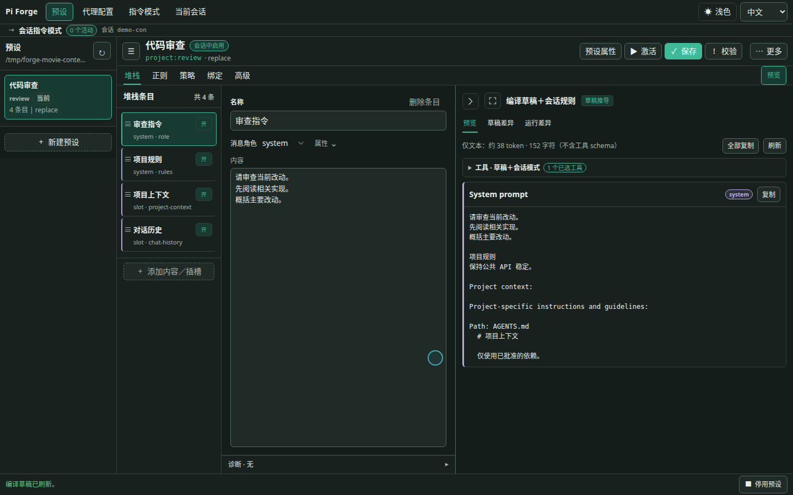
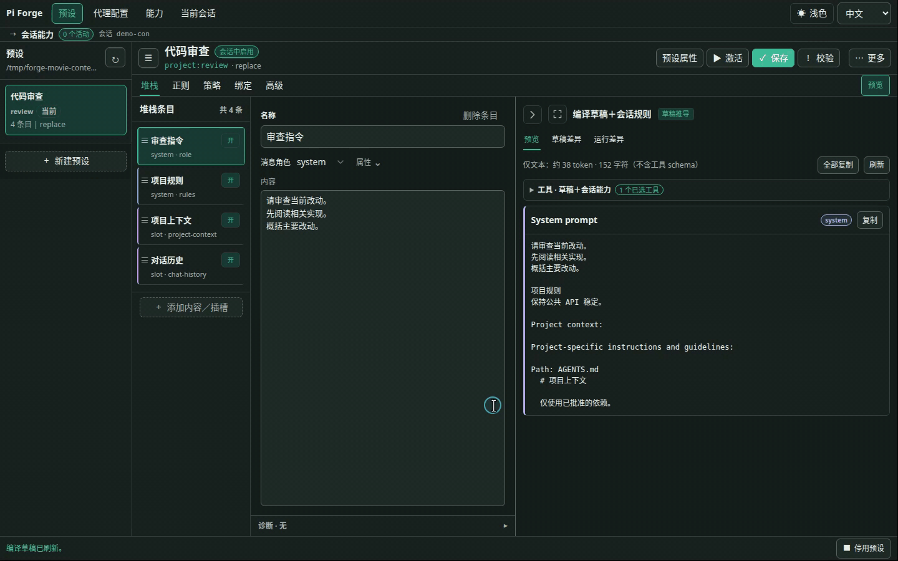
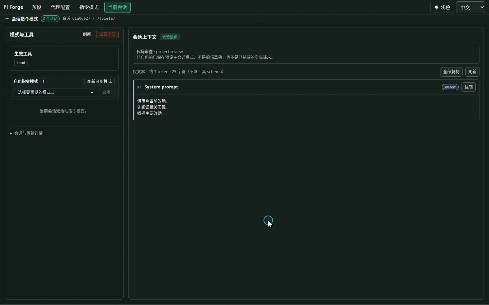
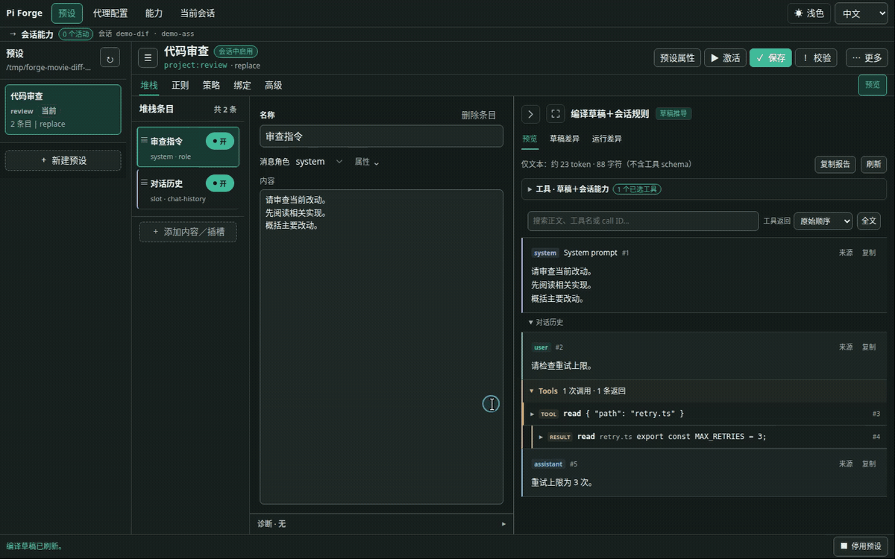

# pi-forge

[English](README.md) | [简体中文](README.zh-CN.md) · [中文文档](docs/zh-CN/README.md) · [快速开始](#安装与第一次使用)

**面向 Pi 的上下文编辑与检查工作台。**

pi-forge 为 [Pi](https://github.com/earendil-works/pi) 提供可视化上下文编排、工具选择、配置复用和请求检查。

## 为什么做这个插件

我希望同时配置 Agent 输入的内容与组合方式，包括系统指令、工具说明、项目文件、示例消息和聊天记录。

受 SillyTavern 预设使用体验的启发，我开发了 pi-forge，用于在 Pi 中编辑这些组成部分，并检查实际发送给模型的请求。



## 功能

### 上下文编排

预设由文本**内容块（Block）**与运行时**插槽（Slot）**组成。内容块可包含指令或示例消息；插槽可填入工具说明、技能、项目文件和聊天记录。条目支持排序与独立开关，Preview 展示编译结果。

你可以替换 Pi 默认的系统提示词，也可以只在它前面或后面加内容。聊天记录能按角色筛选、限制保留的上下文，或者从模型输入中去掉先前的思考内容，不会改写已存储的聊天记录。



### 工具选择与文本变换

- 每份预设都能用 `allow` 或 `deny` 匹配规则控制工具，而不只依赖提示词约束。模式按需启用工具，也不能越过这个许可范围。
- 用 `tools.initial` 选一小组默认启用的工具，需要时再通过模式开启其他已注册、已获准的工具。未配置时沿用原有的工具选择行为。
- 筛选 Forge 展示给模型的技能列表。
- 重复用到的值可以存成不可变参数，再用 `{{ parameters.style }}` 这样的模板插进内容；也可以使用运行时数据和自定义宏。
- 用正则按确定的规则改写出站文本，或者会话记录里已完成的助手消息和工具结果。

### 会话指令模式

**指令模式（Instruction mode）**可以在不切换预设的情况下追加或停用会话规则，并调整可执行工具。典型用途是保留少量默认工具，在探索代码时启用许可范围内的搜索工具。

在 **指令模式（Modes）** 中创建可复用定义，在预设独立的 **绑定（Bindings）** 页签配置授权。**当前会话**的选择器区分未绑定的库模式与当前预设绑定；CLI 的 `/system-update use` 和 `use-bound` 也分别对应这两种操作。想让 Agent 自己控制，可以为具体绑定打开 `modelCallable` 授权；仅将模式加入库中不会自动授予权限。

保存模式不等于启用，修改定义也不会替换会话中已经启用的快照。停用时，会按预设的基础工具集和其他仍启用的模式重新计算；不会抹掉历史、撤回已做的文件修改或中断正在运行的工具。设置方法和生命周期见[指令模式参考](docs/zh-CN/reference/instruction-modes.md)。

**当前会话**将模式与生效工具放在左侧，会话投影放在右侧；启停后可直接查看工具净增减，并定位相关指令更新。它检查已启用的已保存预设，不是编辑草稿或已捕获的实际请求。



### 预览与请求检查

- **预览（Preview）**：编译当前草稿，不发起模型请求。
- **草稿差异（Draft diff）**：将当前草稿与已保存的预设进行比较。
- **运行差异（Run diff）**：比对前后两次 provider 请求。大小估算与 provider 返回的 token／cache 用量分开展示，后者在有返回数据时才显示。
- **请求捕获（Payload capture）**：通过编辑器或 `/payload next`，查看下一次 provider 请求的脱敏版本。

缓存提示会标出容易影响缓存的时间戳宏，也会估算切换预设或 Profile 可能带来的提示词缓存影响。缓存是否复用由 SDK／provider 管理，启停模式或增减工具都不保证命中缓存。



### 配置复用

**Agent Profile** 保存模型、思考强度和预设引用，通过 `/profile use <id>` 应用。预设与 Profile 支持项目和全局作用域；同 ID 时项目资源优先。

可以为编程、审查、写作或角色扮演分别维护配置。

## 安装与第一次使用

Node.js 需要 **22.19 或更高版本**。0.5.5 支持 Pi **0.87.x**（`>=0.87.0 <0.88.0`），已在 **0.87.0** 上验证。

<!-- 发布提示：0.5.5 发布后移除本段；保留下方安装命令。 -->
> **0.5.5 尚未发布。** 指令模式和可配置默认工具目前需要本地开发版。下方 npm 安装命令装到的仍是 0.5.4，它的功能和 Pi 版本要求与这里不同。
> 本地构建与加载方式见[开发配置（英文）](docs/development/setup.md#load-the-extension)。
<!-- END RELEASE NOTE -->

```bash
pi install npm:@zihanw/pi-forge
```

安装或更新后重启 Pi。然后在已信任的项目中：

1. 输入 `/preset ui`，打开本地编辑器。
2. 点 **New preset**，从默认 Pi mirror 布局开始。
3. 改一个内容块或工具策略，在 **Preview** 里看结果。
4. 点 **Save** 保存，再点 **Activate**，让当前会话用上这份预设。

保存未启用的预设不会切换当前会话；保存正在使用的预设会重新加载配置，但不会替换已启用的模式快照。

终端里也可以用 `/preset use <id>` 切换，用 `/preset use none` 停用当前预设。如果想把当前模型、思考强度和预设一起存下来：

```text
/profile save reviewer
/profile use reviewer
```

## Preset、Mode 和 Profile

| 名称 | 保存什么 |
|---|---|
| **Preset（预设）** | 上下文编排、默认工具与工具策略、模式绑定和 Agent 授权、技能列表过滤、正则规则和参数 |
| **Instruction mode（指令模式）** | 可复用的会话规则、工具增减，或两者组合；启用后作为快照保留在会话中 |
| **Agent Profile** | 模型、思考强度，以及要用哪份预设 |

**Stack（提示词栈）** 就是预设里按顺序排列的内容块和插槽。排序分两个通道：system 条目拼成系统提示词，非 system 条目组成消息。把一个 system 内容块拖到聊天记录后面，并不会把它插进那段历史。

Profile 只在应用时更新一次设置。之后手动调整的模型或思考强度会继续生效；当前预设仍会执行工具策略。

## 示例

- [默认 Pi mirror](examples/default-prompt-stack.json)：从一份 Pi 风格的配置开始，内容已经拆成可编辑的文本块和运行时插槽。
- [Minimal worker](examples/minimal-prompt-stack.json)：一行提示词、聊天记录，只留 `bash` 和 `edit` 两个工具。
- [Read-first Worker](examples/read-first-worker-prompt-stack.json)＋[Write tools 模式](examples/instruction-modes/write-tools.json)：默认仅 `read`、`ls` 与模式控制工具，模型按需启用 `bash`／`edit`。[安装与边界](docs/zh-CN/reference/instruction-modes.md#read-first-worker)。
- [正则示例](examples/hack-prompt-stack.json)：拿两种示例 token 格式，演示发送前脱敏，以及清理已存储的会话文本。

更多用法见[模式与用例（英文）](docs/guides/use-cases.md)。

## 可选 Subagents

安装实验性可选包 `@zihanw/pi-forge-subagents`，Agent 就可以用 `forge_subagent_profiles` 查看已获授权的 Profile，再通过 `forge_subagent` 派出一次性的前台任务。

对应的 Profile 要先明确启用，运行默认需要审批。想让模型免逐次审批调用，需要在可信项目里明确授权。隔离能力取决于所选 backend；工具限制不等于操作系统沙箱。

启用前先看[委派指南](docs/zh-CN/guides/delegation.md)。

## 注意事项与文档

- 本项目处于 **0.x** 阶段，更新可能包含不兼容改动。
- `replace` 会替换 Pi 原本的系统提示词。还想保留的工具指南、技能或项目上下文，要自己放进预设。
- 技能过滤只管 Forge 渲染的列表，不会禁用显式 skill 调用。工具策略也不负责隔离文件系统或进程。
- 正则只会处理你选定的文本和匹配规则。`finalize` 会覆盖已存储的助手消息或工具结果，不保留原文。捕获的请求会脱敏，也可能截断，但仍可能包含私人对话。

[快速上手](docs/zh-CN/getting-started.md) · [Web 编辑器](docs/zh-CN/guides/web-editor.md) · [命令参考](docs/zh-CN/reference/commands.md) · [Schema 与策略（英文）](docs/reference/stack-schema.md) · [调试（英文）](docs/guides/debugging.md) · [全部文档](docs/zh-CN/README.md)

## License

[MIT](LICENSE)
