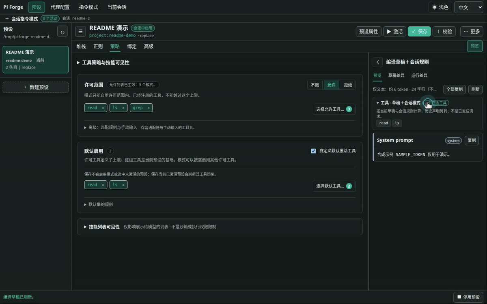
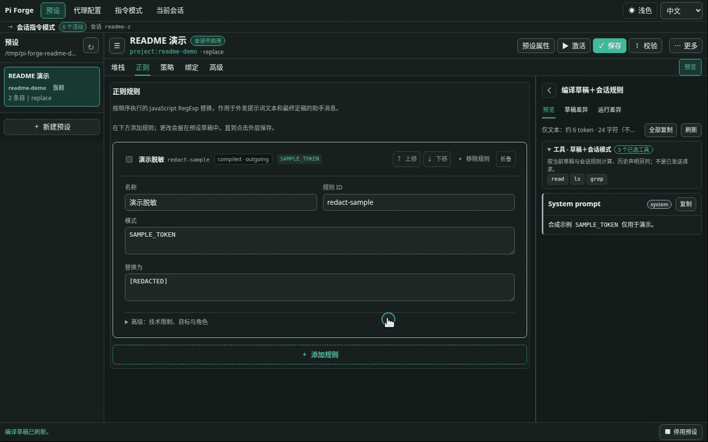

# pi-forge

[English](README.md) | [简体中文](README.zh-CN.md) · [中文文档](docs/zh-CN/README.md) · [快速开始](#安装与第一次使用)


**面向 Pi 的上下文编辑与检查工作台。**

pi-forge 为 [Pi](https://github.com/earendil-works/pi) 提供可视化上下文编排、工具选择、配置复用和请求检查。

> 受 SillyTavern 预设的启发，我开发了 pi-forge，既用来定制 Agent 上下文的内容与组装方式，也用来检查实际发送给模型的请求。

[上下文编排](#上下文编排) · [工具选择](#工具选择) · [正则文本变换](#正则文本变换) · [动态指令与工具](#动态系统提示词与工具) · [预览与请求检查](#预览与请求检查)

> **Optional subagents（可选）**：[pi-forge-subagents](https://github.com/MacroSony/pi-forge-subagents) —— 将任务委派给拥有独立模型与预设的子代理。

## 安装与第一次使用

Node.js 需要 **22.19 或更高版本**。0.5.5 支持 Pi **0.87.x**（`>=0.87.0 <0.88.0`），已在 **0.87.0** 上验证。

<!-- 发布提示：0.5.5 发布后移除本段；保留下方安装命令。 -->
> **0.5.5 尚未发布。** 指令模式和可配置默认工具目前需要本地开发版。下方 npm 安装命令装到的仍是 0.5.4，它的功能和 Pi 版本要求与这里不同。
> 本地构建与加载方式见[开发配置（英文）](docs/development/setup.md#load-the-extension)。
<!-- END RELEASE NOTE -->

```bash
pi install npm:@zihanw/pi-forge
```

安装或更新后重启 Pi。然后在已信任的项目中：

1. 运行 `/forge ui` 打开本地编辑器。
2. 点 **New preset**，从默认 Pi mirror 布局开始。
3. 改一个内容块或工具策略，在 **Preview** 里看结果。
4. 点 **Save** 保存，再点 **Activate**，让当前会话用上这份预设。

喜欢用终端？通过 `/preset use <id>` 选择预设，用 `/instruction use <mode>` 启用模式。你可以从 [Read-first Worker 示例](docs/zh-CN/reference/instruction-modes.md#read-first-worker)开始。

## 功能

### 上下文编排

用可编辑的内容块和插槽组合 Agent 的上下文：指令、工具说明、技能、项目文件和聊天记录都可以放进来。调整顺序或开关条目，直接在预览中看结果。

- **使用场景**：给代码审查 Agent 配上项目规范和相关上下文，而不是让所有任务共用一份越来越长的提示词。
- **上手尝试**：在编辑器的 **Stack** 中编辑或拖动内容块、开关项目上下文，再看 **Preview** 中的变化。


详见 [Web 编辑器指南](docs/zh-CN/guides/web-editor.md)与 [Schema 与策略文档（英文）](docs/reference/stack-schema.md)。

### 工具选择

分别选择 Agent 可以使用哪些工具，以及默认启用哪些工具。允许或禁止列表限定权限范围；默认工具可以更少，其余已获准的工具留给模式按需启用。

- **使用场景**：让代码审查 Agent 专注于阅读和搜索，不提供编辑文件或执行 shell 的工具。
- **上手尝试**：在 **Policy** 中选择许可工具，并将默认工具设为 `read` 和 `ls`。把已获准的 `grep` 加入默认集，在 **Preview** 中查看工具列表；保存并启用预设后应用策略。



详见 [工具策略参考（英文）](docs/reference/stack-schema.md#tool-and-skill-policy)。

### 正则文本变换

用可复用的正则规则查找和替换模型输入，或处理已完成的助手回复与工具结果。

- **使用场景**：发送前替换选定提示词中的已知敏感标记，或者清理回复中反复出现的套话。
- **上手尝试**：在 **Regex** 中配置出站规则，将示例文本 `SAMPLE_TOKEN` 替换为 `[REDACTED]`，目标选择 system 文本。演示中开关这条预先配置的规则，在 **Preview** 中对比结果。



详见 [正则规则参考（英文）](docs/reference/stack-schema.md#regex-transforms)。

### 动态系统提示词与工具

**指令模式（Instruction modes）**可以在对话中动态更新系统提示词和可用工具。让 Agent 从少量工具起步，需要时再加载对应任务的指令与工具，不必重启会话或切换预设。

- **使用场景**：Agent 先用 `read`、`ls` 阅读代码，准备修复问题时再自行启用已授权的编辑模式。
- **上手尝试**：在 **Modes** 中创建模式，在预设的 **Bindings** 页签授权 Agent 使用。你也可以在 **当前会话** 中或通过 `/instruction use <mode>` 手动启用，查看指令和工具的变化。

更新在支持的模型上以原生会话中系统消息送达，其他模型则回退为带标记的用户消息（详见[投递模型说明](docs/zh-CN/reference/instruction-modes.md#投递模型native-与-fallback)）。


详见[指令模式参考](docs/zh-CN/reference/instruction-modes.md)。

### 预览与请求检查

调用模型前先看清修改影响了什么；运行后，再用捕获的请求和用量信息排查问题。

- **使用场景**：确认修改后的提示词包含了想要的指令，或在 Agent 表现不同时对比前后两次请求。
- **上手尝试**：在 `/forge ui` 中切换至 **Preview** 查看编译消息，打开 **Draft diff** 对比未保存修改，或在终端运行 `/forge payload next` 捕获下一次出站请求。


**当前会话**还会显示本轮和当前分支的缓存命中率，主模型与已上报的嵌套工具用量分开统计。这是已记录的用量，不是完整账单。详见[缓存用量](docs/zh-CN/reference/session-cache.md)、[调试指南（英文）](docs/guides/debugging.md)与[命令参考](docs/zh-CN/reference/commands.md)。

## 示例

- [默认 Pi mirror](examples/default-prompt-stack.json)：从一份 Pi 风格的配置开始，内容已经拆成可编辑的文本块和运行时插槽。
- [Minimal worker](examples/minimal-prompt-stack.json)：一行提示词、聊天记录，只留 `bash` 和 `edit` 两个工具。
- [Read-first Worker](examples/read-first-worker-prompt-stack.json)＋[Write tools 模式](examples/instruction-modes/write-tools.json)：默认仅 `read`、`ls` 与模式控制工具，模型按需启用 `bash`／`edit`。[安装与边界](docs/zh-CN/reference/instruction-modes.md#read-first-worker)。
- [正则示例](examples/hack-prompt-stack.json)：拿两种示例 token 格式，演示发送前脱敏，以及清理已存储的会话文本。

用 `/profile save reviewer` 将当前模型、思考强度和预设存为 Agent Profile，再用 `/profile use reviewer` 恢复。更多用法见[模式与用例（英文）](docs/guides/use-cases.md)。

## Subagents（Optional，可选）

可选配套扩展 [`pi-forge-subagents`](https://github.com/MacroSony/pi-forge-subagents) 让 Agent 通过 `forge_subagent`，把代码审查、并行调查等任务交给使用已授权 Profile 的子代理。不安装它，也能使用 Forge 的其他功能。

在配套正式发布前，请使用匹配的本地开发源码。子代理的写入权限与隔离级别取决于所选后端（仅靠工具策略并不构成操作系统级沙箱）。启用前请参阅[委派指南](docs/zh-CN/guides/delegation.md)。

## 注意事项与文档

- 本项目处于 **0.x** 阶段，更新可能包含不兼容改动。
- `replace` 会替换 Pi 原本的系统提示词。还想保留的工具指南、技能或项目上下文，要自己放进预设。
- 技能过滤只管 Forge 渲染的列表，不会禁用显式 skill 调用。工具策略也不负责隔离文件系统或进程。
- 正则只会处理你选定的文本和匹配规则。`finalize` 会覆盖已存储的助手消息或工具结果，不保留原文。捕获的请求会脱敏，也可能截断，但仍可能包含私人对话。
- 提示词栈结构、资源 Schema 与命令详情请参阅下方文档链接。

[快速上手](docs/zh-CN/getting-started.md) · [Web 编辑器](docs/zh-CN/guides/web-editor.md) · [命令参考](docs/zh-CN/reference/commands.md) · [Schema 与策略（英文）](docs/reference/stack-schema.md) · [调试（英文）](docs/guides/debugging.md) · [全部文档](docs/zh-CN/README.md)

## License

[MIT](LICENSE)
