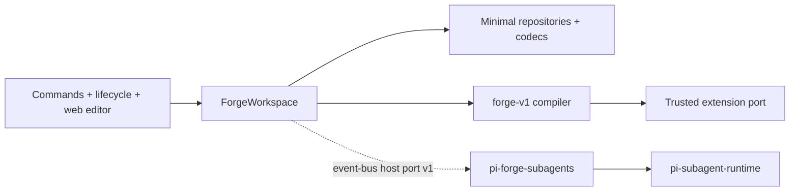

# pi-forge 0.5.0 architecture plan (lean)

[Documentation](../README.md) · [Roadmap](../development/roadmap.md) · [Architecture rules](../development/architecture-rules.md)

Status: accepted lean 0.5.0 scope

Date: 2026-08-18

The long-term architecture goal is unchanged. The original six-phase target plan and Phase-0 evidence are archived in [0.5 full architecture proposal](archive/0.5-full-proposal/README.md). This page is the executable 0.5.0 scope; 0.5.x continues toward the full target.

## Goal

0.5.0 is a breaking cleanup release plus the minimum foundation for later work:

- deterministic immutable prompt compilation;
- prompt-stack schema v2;
- minimal repository/codec persistence seam;
- optional subagents behind a versioned host port;
- an explicit public package surface.

It is not a platformization release.

## Accepted 0.5.0 decisions

1. **SillyTavern is removed completely.** 0.4 is the last supported conversion path. Commands, importer, regex emulation, example, guide, and tests are deleted.
2. **Mutable variables are removed.** Turn/session stores, `setvar`/`setturnvar`/`setsessionvar`/clear/get variable macros, `variables` slot, and `pi-forge-variable-state` entries are removed. Static values become immutable `parameters` in schema v2.
3. **`forge-v1` replaces the macro implementation.** One parsed grammar with interpolation, a finite filter set, and `if`/`else` over documented environment predicates. No includes, loops, function calls, general expressions, or ambient access.
4. **The trusted extension port is retained and redesigned in this release.** `registerMacro` and `registerSlot` survive with a pure contract. The contract is specified in [Extension port contract](#extension-port-contract-050).
5. **Regex `display` and `both` are removed.** Valid effects become `outgoing` and `finalize`. `finalize` behavior is retained with explicit ownership in [Finalize regex ownership](#finalize-regex-ownership-050).
6. **Subagents move to an optional `pi-forge-subagents` package.** The main package removes the hard dependency on `@zihanw/pi-subagent-runtime`. The main package keeps `@zihanw/pi-forge/subagent` as a versioned host port with data-only event-bus messages.
7. **The 0.5.0 host port has a minimal operation catalogue and mandatory lifecycle rules.** Operations are discovery, profile listing/snapshot, and prompt preparation. Correlation IDs, payload validation, timeouts, host generation, duplicate-host failure, disposal/`unavailable`, and listener cleanup are part of host port v1, not deferred.
8. **`ForgeWorkspace` is the minimal resource-state owner, and all stack/profile persistence goes through minimal repositories and codecs in 0.5.0.** Repositories own scoped discovery and mutation; codecs own parse/normalize/validate/serialize. Expected-fingerprint writes and guaranteed atomic replacement are 0.5.x work.
9. **Configuration ownership uses dedicated optional-package files.** Main package owns `webEditor.*` in `.pi/forge/config.json` and its global equivalent. The optional package owns `.pi/forge/subagents.json` and `~/.pi/forge/subagents.json`. Main pi-forge does not read, write, validate, or clean subagent configuration. Legacy `config.json.subagents` is read-only fallback material for the optional package, with warnings and no automatic migration.
10. **Web editor delegation UI is removed from the main package in 0.5.0.** The optional package ships config-only for delegation. A small standalone optional-package editor page is the 0.5.x path; a main-editor contribution port is not designed now.
11. **Pi session custom entries:** newly written stack/profile entries use a `schemaVersion` envelope. Unversioned 0.4 entries are decoded through legacy readers. `pi-forge-variable-state` is never restored or written; one bounded diagnostic is emitted per restoration.
12. **Public surfaces are exactly three intentional entry points:** package root default factory, package root named extension API (`registerMacro`, `registerSlot`, and their contract types), and `@zihanw/pi-forge/subagent`. All other root re-exports and `src/*` aliases are removed. `check-package` enforces this allowlist.
13. **Migration is a small utility plus release notes, not a framework.** A v1-to-v2 script converts mechanical `variables`/macro fields with explicit diagnostics; removed behavior is never silently approximated.

## Extension port contract (0.5.0)

The 0.5.0 extension contract is part of the breaking release. It is a trusted-extension port, not a security boundary.

- `PromptEnvironment` is a deep-frozen, JSON-compatible snapshot with three path roots:
  - `runtime.*` — documented built-in runtime facts;
  - `parameters.*` — immutable stack parameters;
  - `extensions.*` — registered extension values.
- `registerMacro` registers a named, zero-argument pure value renderer:
  - inputs: `{ env: PromptEnvironment; helpers: PromptRenderHelpers }`;
  - declaration: `{ name, description?, source?, dependencies: string[] }`;
  - returns a `string`; `throw` produces a compiler error diagnostic and no partial output;
  - addressed in templates as `{{ extensions.<name> }}`.
- `registerSlot` keeps option-schema validation and is addressed by `kind: "slot"`:
  - inputs: `{ item, options, env, helpers }`;
  - same declaration, return, and error semantics as macros.
- Dependency declarations are authoritative for the analyzer. A renderer must only read declared paths; undeclared reads are contract violations, not enforced isolation.
- Output limits are enforced by the compiler: 100,000 characters per compiled template and 16,384 characters per extension macro/slot value.
- Registration identity is name-based and global within the Forge extension loader. Duplicate registration throws; unregistration returns a disposer. The workspace owns load/reload/dispose ordering and reuses the current trusted extension discovery directories.
- Preview, runtime, and subagent preparation use the same analyzer output. No consumer may parse template syntax independently.

## Finalize regex ownership (0.5.0)

`finalize` is retained, but is explicitly outside deterministic prompt compilation:

- **Owner:** the lifecycle/transcript adapter, not the compiler.
- **Order:** after the provider returns a finalized assistant message, before that message is stored in the transcript.
- **Constraints:** `stage: "compiled"`, `targets: ["messages"]`, and assistant roles only, as validated today.
- **Preview:** preview and runtime prompt compilation never apply `finalize`. Preview reports an informational diagnostic that finalize rules are not represented.
- **Restoration:** the original model output is not preserved. This remains a documented, user-enabled destructive transform carried over from 0.4.
- **Tests:** 0.5.0 adds characterization coverage for finalize ordering and non-application during preview.

## Minimal target state

The final layered target (core modules, full application services, complete host catalogue, fingerprint/atomic persistence) remains the archived full plan and is reached in 0.5.x.

## Implementation lanes

Only one lane is active at a time. Each lane ends with `npm run verify` green and committed.

### Lane 0: documentation convergence

Archive the full proposal, make this lean plan active, and simplify repository guidance and PR requirements.

### Lane 1a: removals only

- Remove SillyTavern code, tests, examples, and guides.
- Remove mutable variable stores, variable session entries, variable macros, and the `variables` slot.
- Remove regex `display`/`both` and make them validation errors.
- Keep static `stack.variables` working through the existing compiler until schema v2 lands in Lane 1b.
- Update only tests that cover removed behavior.

### Lane 1b: compiler, schema v2, and extension contract

- Implement `forge-v1` parse/analyze/render.
- Introduce frozen `PromptEnvironment` and make preview/runtime/subagent preparation share one compiler entry.
- Introduce schema v2 with immutable `parameters`.
- Implement the [extension port contract](#extension-port-contract-050).
- Retain `finalize` under the ownership rule above and add its characterization coverage here.
- Add compiler/schema/extension conformance coverage.

### Lane 1c: migration and documentation

- Add the small v1-to-v2 migration script with explicit diagnostics.
- Migrate examples and update English and Chinese user-facing compiler/schema/extension docs.
- Update changelog and migration notes for the Lane 1 breaks.

### Lane 2a: minimal repositories and codecs

- Extract stack/profile codecs as the single parse/normalize/validate/serialize source.
- Extract scoped repositories as the only domain resource read/write/delete path, including scope and containment validation.
- Remove direct domain-resource writes from web host, commands, and profile service.
- Do not add expected-fingerprint conflicts or guaranteed atomic replacement yet; characterize current replacement behavior with tests.

### Lane 2b: ForgeWorkspace and host port v1

- Introduce `ForgeWorkspace` as the minimal snapshot owner over the Lane 2a repositories.
- Publish `@zihanw/pi-forge/subagent` host port v1 with mandatory lifecycle rules and the three minimal operations.
- Cover timeout, duplicate-host failure, generation, disposal, and listener cleanup in tests.

### Lane 3: subagent extraction

- Create `pi-forge-subagents` by moving current subagent commands, tools, config parsing/writing, and execution code.
- Optional package depends only on documented host-port messages and owns the dedicated `subagents.json` files, with read-only legacy fallback.
- Remove main-package delegation UI and all subagent configuration reads/writes.
- Main package installs and passes verification without the subagent runtime.
- Optional package passes packed-install smoke tests.

### Lane 4: public surface and release

- Enforce the three intentional public surfaces and remove all other root exports and `src/*` aliases; update package checks and public-API tests together.
- Update English and Chinese user-facing docs for breaking changes.
- Write changelog and one-page migration notes.
- Run main-only and main-plus-optional packed-install verification.
- Tag and publish 0.5.0.

## Release gates

- `npm run verify` passes.
- All stack/profile persistence goes through minimal repositories and codecs.
- Runtime and preview compile through one `forge-v1` entry point.
- Host port v1 passes discovery, timeout, generation, duplicate-host, and disposal tests.
- `finalize` ordering and preview exclusion are characterized.
- Schema v2, extension contract, and migration notes are documented.
- Main package has no subagent runtime dependency and passes packed smoke tests alone.
- Optional package passes packed smoke tests through host port v1 and owns only its dedicated config files.
- No non-allowlisted root exports or `src/*` aliases remain.
- User-facing breaking changes are documented in English and Chinese.

## Deferred to 0.5.x

These items come from the archived full plan and are intentionally not part of 0.5.0:

- expected-fingerprint conflict writes and guaranteed atomic file replacement;
- physical `pi-forge-core` package and enforced module/package boundaries;
- automatic dependency-direction checking;
- full `PromptStackService` / `AgentProfileService` application facades;
- complete host RPC operation catalogue, progress events, and richer lifecycle features beyond host port v1;
- optional-package standalone delegation UI or a main-editor contribution port;
- full public-surface classification register and consumer audit repeat;
- rolling Pi compatibility matrix and scheduled latest-Pi probe;
- sandbox, staged writes, new prompt features, richer imports, and orchestration.
