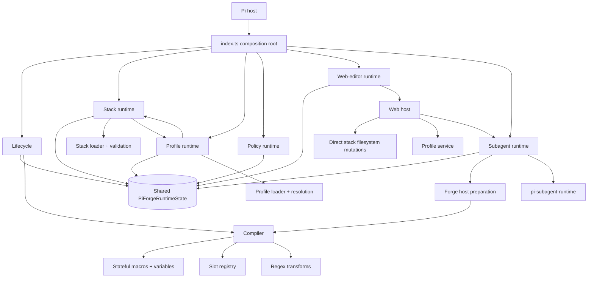
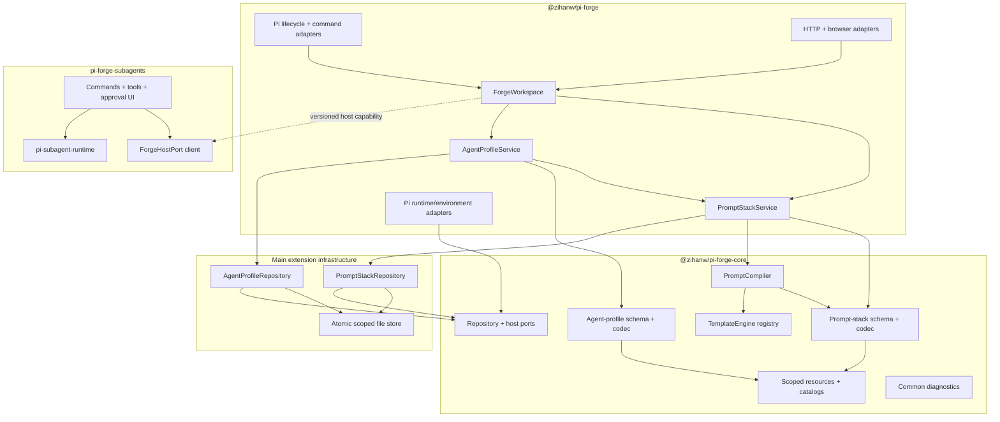

# pi-forge 0.5 architecture plan

[Documentation](../README.md) · [Development rules](../development/architecture-rules.md) · [Roadmap](../development/roadmap.md)

Status: proposed

Date: 2026-08-17

0.5 is a deliberately breaking stabilization release. Its purpose is to make the extension understandable and evolvable before adding more features. Compatibility is preserved only where it has a demonstrated consumer and does not compromise the target boundaries.

## Problem statement

The 0.4 implementation is well tested, but feature throughput has outpaced architectural consolidation. Prompt stacks, profiles, web editing, mutable variables, imports, payload debugging, and subagents share state and orchestration paths. Several adapters perform application or persistence work directly, and internal file-shaped exports constrain reorganization.

The problem is not primarily file size. It is unclear ownership and too many ways to load, validate, mutate, compile, or present the same resources.

## Release goals

0.5 will:

- establish a one-directional architecture with explicit domain, application, port, infrastructure, and adapter layers;
- make a `ForgeWorkspace` the owner of coherent prompt-stack/profile resource state;
- unify stack/profile persistence behind scoped repositories and codecs while keeping their domain models separate;
- make prompt compilation deterministic over a normalized immutable environment;
- remove mutable turn/session variables and render-time variable mutation;
- replace the macro implementation only through an explicit template-engine contract, preserving a legacy reader only when migration requires it;
- extract optional subagent integration from the main extension through a versioned host port;
- remove or sharply reduce SillyTavern-specific functionality;
- replace wildcard internal exports with intentional package entry points;
- simplify commands and the web editor into adapters over shared application services.

## Non-goals

0.5 will not add orchestration, background agents, pipelines, retries, queues, new regex modes, richer imports, or new editor product surfaces. Sandbox and staged-write work remains deferred until the package and host boundaries are stable.

The refactor does not merge profiles, stacks, and compilation into one domain object. They share infrastructure and an application facade, but retain distinct responsibilities.

## Accepted architectural decisions

### Breaking cleanup is preferred to indefinite compatibility

0.5 may change JSON schema, public TypeScript APIs, commands, package exports, and internal storage coordination. Every user-visible break must have an explicit migration note; not every 0.4 feature requires a compatibility implementation.

### Mutable variables are removed

The following 0.4 behavior is removed from the 0.5 core design:

- turn and session variable stores;
- `setvar`, `setturnvar`, `setsessionvar`, and clear-variable macros;
- variable persistence in Pi session entries;
- the `variables` slot;
- render-time mutation through custom macro/slot contexts.

Templates receive an immutable context containing built-in runtime values. Static reusable values, if retained, become immutable stack parameters; whether parameters justify their schema cost is an implementation-gate decision, not an assumption.

### SillyTavern is not a core architecture driver

The current fidelity-oriented importer, regex translation, report surface, command, guide, and dedicated example are removed from the core 0.5 scope. Before deletion lands, one decision will choose between:

1. removing import completely and documenting 0.4 as the last supported conversion path; or
2. retaining a small stateless best-effort converter that maps only ordered enabled text blocks and a history marker, with no SillyTavern variable or regex emulation.

The default recommendation is complete removal. A richer converter can later live in a separate package without shaping the prompt compiler.

### Subagents become optional integration

The main extension retains profile/stack resolution and prompt preparation. A separate `pi-forge-subagents` extension owns delegation configuration, tools, commands, approval/progress UI, execution adaptation, and its dependency on `@zihanw/pi-subagent-runtime`.

The extraction must use a versioned Forge host port. It may not import internal runtime state, duplicate the active resource workspace, or make ordinary stack/profile usage depend on a subagent package.

### Schemas and public APIs restart deliberately

Prompt-stack schema v2 describes the cleaned compiler and template model. Agent-profile v2 is introduced only if its stored shape must change. The package no longer exports implementation modules through `src/*`; public surfaces are explicit entry points with documented stability.

## Current 0.4 architecture



The high-risk connections are shared state ownership, circular stack/profile coordination, direct persistence in adapters, and optional subagent concerns reaching the core editor and composition root.

## Target package and component architecture



`pi-forge-core` is host-neutral: it does not import the Pi extension API, HTTP, browser, TUI, or subagent runtime. If physical package extraction would delay boundary work, the same structure may land first as enforced internal modules and become a package before the subagent split.

## Target responsibilities

### ForgeWorkspace

- Own one immutable workspace snapshot containing scoped stack/profile catalogs and active selection/provenance references.
- Coordinate extension registration, resource reload, and snapshot publication without circular runtime callbacks.
- Expose application services and resource-change subscriptions to adapters.
- Keep payload debugging and browser presentation state outside the resource snapshot.

### PromptStackService

- List, resolve, validate, create, update, fork, delete, activate, preview, and compile stacks.
- Own auto-activation selection and active-stack state transitions.
- Coordinate tool-policy changes through a Pi runtime port rather than calling UI or persistence code.

### AgentProfileService

- List, resolve, validate, create, update, delete, preflight, apply, and report provenance/drift.
- Apply model, thinking, and stack transactionally through a runtime-controller port.
- Resolve stack references through the workspace catalog, not through a separate loader.

### Repositories and codecs

- Repositories implement scoped discovery and safe mutation.
- Codecs are the only schema parsing, normalization, validation, serialization, and fingerprint source.
- Updates/deletes carry expected fingerprints to prevent overwriting unseen external changes.
- Filesystem writes use atomic replacement where the platform permits it.

### PromptCompiler and TemplateEngine

- Consume a normalized immutable `PromptEnvironment`, not a live Pi context.
- Return system prompt, prepared messages, sources, diagnostics, template dependencies, and an explicit variable/parameter receipt if parameters are retained.
- Keep history placement, structured runtime slots, tool/skill selection, and outgoing deterministic transforms as separate compiler stages.
- Use an engine contract with parse, analyze, and render operations. A restricted Jinja-like engine is a candidate, not yet an accepted dependency.

### Adapters

- Parse external input and render typed service results.
- Contain no resource persistence or duplicated schema validation.
- Browser view models and HTTP status mapping remain outside application/domain state.

## Proposed source layout

The exact filenames may evolve, but ownership should converge on:

```text
packages/
  core/
    src/resources/
    src/prompt-stacks/
    src/profiles/
    src/compiler/
    src/templates/
    src/ports/
  pi-forge/
    src/application/
    src/infrastructure/
    src/adapters/pi/
    src/adapters/commands/
    src/adapters/web/
  pi-forge-subagents/
    src/host/
    src/runtime/
    src/adapters/commands/
    src/adapters/tools/
```

Moving to a workspace is an implementation choice, not permission to move files before their interfaces and ownership are characterized.

## Feature disposition

| 0.4 capability | 0.5 disposition |
|---|---|
| Ordered prompt blocks and runtime slots | Keep and move into the v2 compiler |
| Scoped global/project resources | Keep behind common repositories/catalogs |
| Tool policy and model-visible skill filtering | Keep stack-owned |
| One-shot profiles, transactional apply, provenance, drift | Keep in `AgentProfileService` |
| Web stack/profile editor | Keep as adapters over services; simplify during migration |
| Prompt preview and redacted payload debugging | Keep; isolate debugging state |
| Turn/session variables and mutation macros | Remove |
| Static stack variables | Decide whether to remove or replace with immutable parameters |
| Current custom macro API | Break and replace with the template/slot extension contract |
| SillyTavern fidelity importer and regex emulation | Remove from core; minimal converter requires a separate decision |
| Regex history/compiled transforms | Keep initially; no new modes during 0.5 |
| Destructive finalized-transcript regex | Audit separately before schema v2 is frozen |
| Foreground subagent integration | Move to optional `pi-forge-subagents` |
| `src/*` package exports | Remove |
| Legacy prompt-stack storage migration command | Remove after documenting the required pre-0.5 migration path |

## Implementation phases

### Phase 0: freeze and characterize

- Announce the 0.5 feature freeze in repository guidance and roadmap.
- Inventory public exports, persisted entries, commands, schemas, examples, and real internal consumers.
- Add characterization tests around any behavior that will move before changing ownership.
- Decide the four implementation gates listed under open decisions.

Exit: the removal/migration inventory is reviewed, and no unplanned feature work is in flight.

### Phase 1: resource core and repositories

- Introduce common diagnostic and loaded-resource envelopes.
- Extract stack/profile codecs.
- Implement repository ports and guarded filesystem repositories.
- Move all stack mutations out of `web-host.ts` and import commands.

Exit: every domain resource mutation uses a repository and has consistent stale-write/path-safety behavior.

### Phase 2: application services and workspace

- Consolidate stack operations into `PromptStackService`.
- Consolidate profile operations into `AgentProfileService`.
- Introduce `ForgeWorkspace` and publish coherent reload snapshots.
- Split debug/browser state away from resource state.
- Replace circular stack/profile runtime wiring.

Exit: commands, lifecycle, and web host use services; `PiForgeRuntimeState` is removed or reduced to adapter-owned state with no domain ownership.

### Phase 3: compiler and schema v2

- Define normalized `PromptEnvironment`, compiler result, and template-engine contracts.
- Remove mutable variables and session variable persistence.
- Select and implement the v2 template syntax.
- Make template dependency analysis authoritative.
- Decide the retained regex surface and freeze prompt-stack schema v2.

Exit: compilation is deterministic over immutable inputs, previews and runtime use the same entry point, and v1-to-v2 migration behavior is documented and tested.

### Phase 4: adapter cleanup

- Reduce Pi lifecycle modules to event adaptation.
- Reduce commands and HTTP handlers to parsing/result rendering.
- Split web view-model construction from application workflows.
- Remove SillyTavern and other rejected compatibility/product surfaces.

Exit: dependency checks show adapters pointing inward with no direct resource persistence.

### Phase 5: subagent extraction and packages

- Validate cross-extension capability discovery with a focused spike.
- Publish the versioned Forge host port.
- Move subagent configuration, commands, tools, UI, and runtime adaptation into `pi-forge-subagents`.
- Ensure main pi-forge installs and runs without subagent dependencies.
- Remove subagent UI/configuration from the core web editor unless an explicit contribution port is accepted.

Exit: ordinary stacks/profiles have no dependency on the optional package, and the optional extension consumes only documented public ports.

### Phase 6: public surface and release

- Replace root re-export sprawl with explicit package entry points.
- Remove `src/*` aliases and 0.4 compatibility barrels.
- Complete migration guide, changelog, package checks, and documentation rewrite.
- Run packed-install tests against supported Pi versions with and without `pi-forge-subagents`.

Exit: all release gates below pass.

## Open implementation-gate decisions

These must be accepted during Phase 0, before their implementation begins:

1. **Template language:** restricted Jinja-compatible syntax, a smaller Forge syntax, or another parsed engine. Required properties are deterministic rendering, strict undefined behavior, AST dependency analysis, no arbitrary includes/evaluation, and an immutable context.
2. **Static parameters:** remove them entirely or retain a JSON-compatible immutable `parameters` object in stack schema v2.
3. **SillyTavern migration:** complete removal or a minimal stateless block/history converter. The converter must not reintroduce variable or regex emulation.
4. **Cross-extension host discovery:** prefer a Pi-native service mechanism if available; otherwise specify a versioned single-owner process registry with duplicate-version detection and disposal semantics.

## Migration policy

- Provide a v1-to-v2 stack migration command or standalone script for mechanically convertible fields.
- Mutable variable behavior that cannot be preserved becomes an explicit migration diagnostic, not a silent approximation.
- Recommend running the final 0.4 release to convert legacy `.pi/prompt-stacks` storage before upgrading if 0.5 removes that migration command.
- Agent profiles retain IDs and scoped stack references where possible; migration rewrites only schema fields that actually change.
- SillyTavern users either convert with 0.4 before upgrading or use a separately retained minimal converter if that decision is accepted.
- No compatibility shim is accepted without a named consumer, test, warning/removal version, and owner.

## Release gates

0.5 is ready only when:

- dependency direction is checked automatically;
- all resource persistence is repository-owned;
- workspace reload and profile application have transactional/integration coverage;
- runtime and preview compilation share one compiler entry point;
- mutable variables and their persisted entries are removed or explicitly migrated;
- schema v2 and public entry points are documented without `src/*` exports;
- main pi-forge passes verification without installing the subagent extension/runtime;
- the optional subagent package passes host-version, preparation, approval, cancellation, and packed-install tests;
- current and target architecture diagrams match the implementation;
- English user documentation is updated and the required Chinese documentation scope is explicitly decided for the breaking release;
- `npm run verify` and packed-install smoke tests pass on the documented Pi compatibility range.

## Deferred until after 0.5

- New prompt composition features.
- New import formats or high-fidelity external-preset emulation.
- Sandbox and staged subagent writes.
- Background/resumable agents, chains, queues, or orchestration.
- New web-editor surfaces unrelated to the migration.
- Additional regex or transcript-rewriting behavior.
