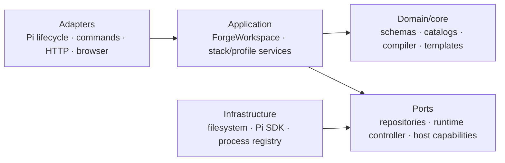

# Architecture and development rules

[Documentation](../README.md) · [0.5 architecture plan](../design/architecture-0.5.md)

These rules keep implementation throughput from outrunning architectural understanding. They apply to humans and coding agents. The intent is not to slow local implementation; it is to make boundary changes scarce, explicit, and reviewable.

## Decision authority

Implementation may move quickly inside an accepted boundary. A change to a boundary, persistent model, public contract, or product concept requires an explicit design decision before implementation.

Agents may draft decisions, diagrams, interfaces, migration plans, and implementation slices. A human maintainer accepts the decision and its tradeoffs.

## Development mode for 0.5

Until the 0.5 release gates are complete:

- Feature development is frozen unless the feature is explicitly added to the 0.5 plan.
- Only one boundary-changing initiative should be active at a time.
- Simplification and removal are preferred over compatibility layers without a demonstrated consumer.
- A completed slice must leave the repository in a coherent, documented, verified state; partial architecture migrations must not silently become permanent.

## Required dependency direction

Infrastructure implements inward-facing ports. Domain/core code must not import adapters or infrastructure implementations.

Until the target directory/package structure exists, apply the rule to logical ownership rather than relying on current file locations.

## Component rules

### Domain and compiler

- Domain types contain no command, HTTP, browser, TUI, or filesystem behavior.
- Prompt compilation consumes a normalized, immutable prompt environment rather than a live Pi context.
- Compilation returns prompt output, diagnostics, dependencies, and any explicit state transition. Renderers must not silently mutate shared state.
- Template dependency analysis is part of the template-engine contract; subagents and previews must not reverse-engineer template syntax independently.
- Tool policy remains stack-owned. Profiles may reference a stack but must not duplicate the policy.

### Application services

- `ForgeWorkspace` owns a coherent workspace snapshot and coordinates resource reloads.
- `PromptStackService` owns stack resolution, mutation, activation, validation, and preview/compile entry points.
- `AgentProfileService` owns profile resolution, mutation, preflight, transactional application, provenance, and drift.
- Services expose typed results. Adapters translate those results into command messages, HTTP statuses, and UI view models.

### Persistence

- All profile and stack reads/writes/deletes go through repositories.
- Repositories use codecs as the single source of parsing, normalization, validation, and serialization.
- Mutations validate scope and containment. No adapter may call `writeFileSync` or `unlinkSync` for a domain resource.
- **Lean 0.5.0 interim:** repositories and codecs are introduced in minimal form. Expected-fingerprint writes, fingerprinting in codecs, and guaranteed atomic file replacement are 0.5.x work. Current replacement semantics remain characterized by tests until then.

### State

- Every mutable value has one named owner.
- Debug payload capture, browser presentation state, prompt resource state, and session provenance are separate state slices.
- Reload produces a complete snapshot before publishing it. Consumers must not observe a half-reloaded stack/profile graph.
- New session-persisted state requires a version, restoration semantics, migration behavior, and an architecture decision.

### Adapters and optional packages

- Commands and HTTP handlers parse input, invoke an application service, and render a result; they do not implement domain workflows.
- Browser view models must not leak into core runtime state.
- Optional extensions use versioned host ports and fail clearly when the required host version is unavailable.
- `pi-forge-subagents` must not load an independent conflicting copy of the active Forge workspace or reach into pi-forge internals.

### Public APIs

- Public API is an allowlist of package entry points, not a side effect of file placement.
- The 0.5 release removes the broad `src/*` compatibility surface.
- A public type should describe a stable domain or port, not an internal runtime object.
- Breaking changes belong in the changelog and the 0.5 migration guide.

## Change classification

### Local change

A local change stays within one accepted component and preserves schemas, state ownership, dependency direction, and public behavior. It needs focused tests and ordinary review.

Examples include fixing a renderer, improving a view mapper, or extracting a private helper within one service.

### Boundary-affecting change

A boundary-affecting change moves responsibility, adds a dependency across components, changes an application port, or introduces a new state owner. It requires an accepted architecture decision or an amendment to the 0.5 plan.

### Product-affecting change

A product-affecting change adds/removes a feature, changes a schema, alters persistence or trust semantics, or changes a public API/package. It requires an accepted decision, migration notes, documentation updates, and explicit human review.

## Architecture-decision triggers

An architecture decision is required when changing any of the following:

- package or extension boundaries;
- JSON schemas or persisted session entries;
- public exports or compatibility promises;
- `ForgeWorkspace` or another state owner;
- compiler/template semantics;
- filesystem repository guarantees;
- trust, approval, tool-policy, or provider-egress boundaries;
- cross-extension discovery;
- removal or addition of a product-level feature.

Use the [architecture decision template](../design/decision-template.md). Small decisions can amend the active 0.5 plan instead of creating a separate document if the alternatives and consequences remain clear.

## Pull-request requirements

During lean 0.5.0, every pull request states summary, breaking impact, and verification, as in the repository template. Boundary- or product-affecting changes must link to the accepted decision in the [lean 0.5 plan](../design/architecture-0.5.md); a separate decision document is not required for decisions already accepted there.

For full-target 0.5.x work, pull requests additionally state change classification, affected components, dependency-direction/state/schema/public-API impact, and the linked decision.

## Definition of done

A slice is complete when:

1. Ownership and dependency direction match the accepted architecture.
2. Behavior is covered at the narrowest useful level; cross-adapter behavior has integration coverage.
3. No domain persistence remains in command, HTTP, or browser-host adapters.
4. Public and persisted changes include migration notes.
5. Current and target documentation reflect any moved boundary.
6. Generated artifacts are synchronized.
7. `npm run verify` passes for release-sized or cross-cutting work.

## Review stop conditions

Stop and request architectural review when an implementation needs to:

- import an adapter from domain/application code;
- access `PiForgeRuntimeState` from a new component;
- add mutable template variables or render-time side effects;
- write a resource outside a repository;
- add a wildcard export;
- duplicate profile/stack loading in another extension;
- retain a compatibility layer with no named consumer or removal date;
- introduce a second boundary-changing initiative before the current one is complete.
